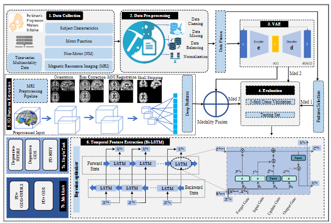
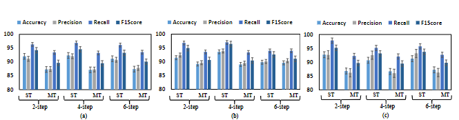

A multitask deep learning model and multimodal time series data are utilized for detecting the progression of Parkinson's disease and predicting the prognosis of depression.
-------------
This repository contains the code and analysis findings used for depression prediction and Parkinson's disease progression detection with multitask deep learning.


### The design of the suggested framework's structure.

<div align="center">
  
  
  
</div>

<p align="justify">
There are many stages to the suggested framework for multitask categorization. The first step is to gather a dataset that includes information from several different sources. Second, to guarantee the reliability of the model, many preprocessing methods are used, including normalization and class imbalance correction. Finally, a variational autoencoder is utilized for feature extraction (VAE). In the fourth step, a 3D convolutional neural network (CNN) is used to extract deep features from MRI data, which are then integrated with the information generated by the VAE. Five-fold cross-validation and testing are used for evaluation. The chosen features and the fused features are utilized to train the model. Once the hyperparameters have been optimized, the model is tested on a validation dataset to assess its performance.
</p>

Improvements 1, 2, and 3 are three distinct experimental methodologies used to optimize single and multi-task performance. The methods used to achieve these outcomes are elaborated upon in the next section: Results and Discussion.


### PPMI Dataset 
<p align="justify">
This research makes use of the PPMI database, which may be viewed at Database link. This database tracks the development of Parkinson's disease throughout the world and includes rich patient and clinical details.
</p>

#### Results analysis
<p align="justify">
The research is broken down into two groups: single-task experiments and multitask experiments. Single-task tests focused on training our proposed model to predict a single classification task, such as NHY stage, depression degree, or the existence of depression in a patient. In order to anticipate two or three separate classification tasks at once, we built the model for the multitask tests with that in mind. In this part, we use measures like as accuracy, precision, recall, and F1-score to assess the efficacy of our suggested model.
</p>
<div align="center">
  
  

</div>
<p align="justify">
This research evaluates the efficacy of the suggested model in predicting Parkinson's disease (PD) severity in patients using the NHY scale, both with and without depression, and at varying time steps in single-task and multitask (three-task) tests. The evaluation uses (a) a four-class NHY scale to determine the stage of PD, (b) a binary class to determine the presence or absence of depression, and (c) a four-class depression scale to determine the degree of depression severity. The standard error is depicted by the bar at the top of each column, and the performance metrics are compared to the testing dataset.
</p>

### Guideline for reproducing results 

# Upon obtaining the dataset, it is preprocessed according to the problem statement.

Run 
```bash
01_Depression_BiLSTM.ipynb 
```
To find out Best model parameters 
Run
```bash
02_KerasT_Bilstm.ipynb    
```
# Directory
<pre>

├─model
│  ├─01_Depression_BiLSTM.ipynb
│  │─02_KerasT_Bilstm.ipynb      
│  └─03_Keras tuner.ipynb 
│          
│─Figures
│    └─Figure1.png
│    ├─Figure2.png
│   
└─requirements.txt
</pre>
